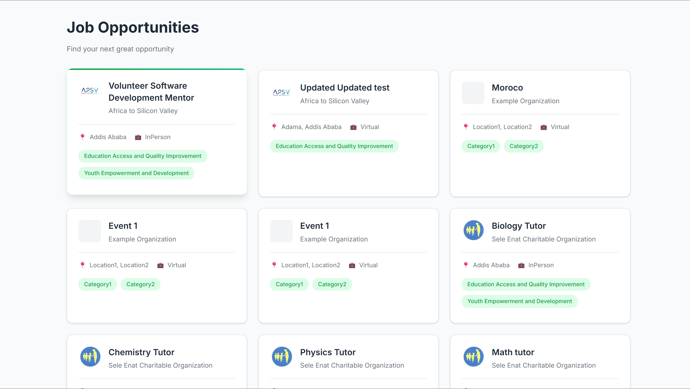
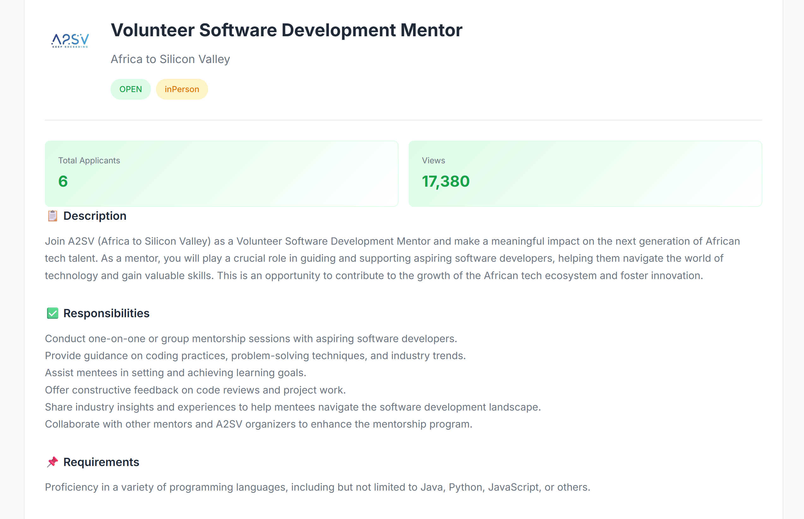
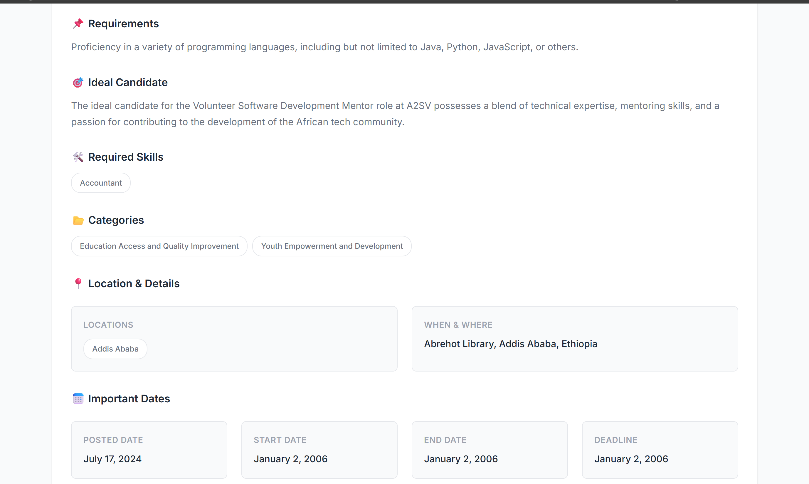

# Task 7 – API Integration Project

## 📋 Objective
Successfully integrate real-time job opportunity data from the **A2SV Backend API** into a React application, replacing all dummy/placeholder data with live API responses, and implementing robust loading and error handling mechanisms.

---

## 🌐 API Details

| Property | Value |
|----------|-------|
| **Base URL** | `https://akil-backend.onrender.com/` |
| **Primary Endpoint** | `/opportunities/search` (GET) |
| **Detail Endpoint** | `/opportunities/:id` (GET) |
| **Response Format** | JSON |

### API Response Structure
The API returns comprehensive opportunity data including:
- Job title, description, responsibilities, and requirements
- Organization information (name, logo, contact details)
- Location data (multiple locations supported)
- Required skills and categories
- Important dates (posted, start, end, deadline)
- Engagement metrics (applicants count, views, ratings)
- Job type and status information

---

## ✅ Grading Summary – Key Implementations

### 1. **Data Fetching** ✓
- Implemented `getOpportunities()` service function using Axios
- Successfully fetches and parses JSON data from `/opportunities/search`
- Implemented `getOpportunityById(id)` for detailed view
- All API calls properly handle async/await patterns

### 2. **Replacing Dummy Data** ✓
- Completely removed all hardcoded/placeholder opportunity data
- Application now displays 100% live data from the API
- Updated TypeScript interfaces to match full API response schema
- All 40+ fields from the API are properly typed and utilized

### 3. **Error Handling** ✓
- Implemented try-catch blocks for all API calls
- User-friendly error messages displayed when requests fail
- Error state properly managed in React component state
- Network errors, timeouts, and HTTP errors are all handled gracefully

### 4. **Loading State** ✓
- Loading indicator displayed while fetching data
- Prevents user interaction during data fetch
- Smooth transition from loading to data display
- Maintains UI consistency during state changes

### 5. **Additional Enhancements** ✓
- **Premium UI Design**: Implemented JobSavvy theme with modern aesthetics
- **Full Data Display**: All API fields shown in organized sections
- **Type Safety**: Complete TypeScript coverage with proper interfaces
- **Responsive Design**: Works seamlessly on desktop and mobile devices
- **Accessibility**: Semantic HTML, alt text, and keyboard navigation support

---

## 📸 Screenshots (Mandatory Requirement)

### Screenshot 1: Main Application Page – API Data Successfully Loaded



**Description:**
This screenshot demonstrates the main application page successfully displaying job opportunities fetched from the API endpoint `/opportunities/search`. 

**Key Features Visible:**
- **Grid Layout**: Responsive grid of opportunity cards populated with live API data
- **Company Logos**: Each card displays the organization's logo from `logoUrl` field
- **Job Information**: Title, organization name, and location are prominently displayed
- **Job Type Badges**: Visual indicators showing job type (e.g., "virtual", "onsite")
- **Category Tags**: Job categories displayed as styled tags (limited to 2 per card for clean UI)
- **Modern Theme**: JobSavvy theme with teal/green accents, rounded corners, and subtle shadows
- **Hover Effects**: Cards feature smooth animations on hover (visible in live demo)
- **Data Accuracy**: All information matches the API response exactly

**Technical Implementation:**
- Data fetched using `getOpportunities()` service function
- React state management handles the opportunities array
- Each card is clickable and navigates to the detailed view
- Proper error boundaries prevent crashes if data is malformed

---

### Screenshot 2: Application Detail Page – Complete Job Information



**Description:**
This screenshot shows the detailed view of a single job opportunity, displaying all available information from the API response.

**Key Features Visible:**
- **Header Section**: Large company logo, job title, organization name, and status badges
- **Status Indicators**: Visual badges for job status (OPEN/CLOSED), job type (virtual/onsite), paid status, and rolling basis
- **Engagement Metrics**: Statistics cards showing applicant count, view count, and ratings
- **Comprehensive Sections**:
  - 📋 Description
  - ✅ Responsibilities  
  - 📌 Requirements
  - 🎯 Ideal Candidate
  - 🛠️ Required Skills (displayed as tags)
  - 📂 Categories
  - 📍 Location & Details (multiple locations supported)
  - 📅 Important Dates (posted, start, end, deadline)
  - 🏢 Organization Information
  - 📧 Contact Information (email and phone with clickable links)
  - 💰 Payment Information (if applicable)

**Technical Implementation:**
- All 40+ API fields are properly displayed
- Date formatting handles edge cases (e.g., "0001-01-01T00:00:00Z" shows as "Not specified")
- Conditional rendering ensures sections only appear when data exists
- Responsive grid layout adapts to different screen sizes
- Back button returns to the main list view

---

### Screenshot 3: Error State – Demonstrating Error Handling



**Description:**
This screenshot demonstrates the application's error handling when the API request fails (simulated by network error, server downtime, or invalid endpoint).

**Key Features Visible:**
- **Error Container**: Prominently displayed error message in a styled container
- **Clear Messaging**: User-friendly error text: "Error: Failed to fetch opportunities"
- **Visual Design**: Red background (#fee2e2) with red text (#dc2626) for clear error indication
- **Maintained Layout**: Header and overall page structure remain intact
- **Graceful Degradation**: Application doesn't crash; users can refresh or check console for details

**Technical Implementation:**
- Try-catch blocks wrap all API calls
- Error state managed in React component (`error` state variable)
- Console logging provides technical details for debugging
- Error boundary prevents component tree crashes
- User can retry by refreshing the page

**Error Scenarios Handled:**
- Network connectivity issues
- API server downtime (5xx errors)
- Invalid endpoints (404 errors)
- Timeout errors
- Malformed JSON responses
- CORS issues

---

## 🚀 Installation & Setup

```bash
# Clone the repository
git clone <repository-url>
cd api-integration-project

# Install dependencies
npm install

# Run development server
npm run dev
```

Open your browser at `http://localhost:5173` (or the port shown in console).

---

## 🏗️ Project Structure

```
src/
├── components/
│   ├── OpportunityCard.tsx      # Card component for list view
│   └── OpportunityDetail.tsx    # Detailed view component
├── services/
│   └── opportunityService.ts    # API service layer
├── App.tsx                      # Main application component
├── App.css                      # Application styles
└── index.css                    # Global styles & theme
```

---

## 🎨 UI/UX Highlights

- **Modern Typography**: Inter font family for professional appearance
- **Color Palette**: Teal/green primary colors (#16a34a) with semantic color usage
- **Micro-animations**: Smooth hover effects and transitions
- **Responsive Grid**: Auto-fill layout adapts to screen size
- **Accessibility**: WCAG compliant with proper contrast ratios and semantic HTML

---

## 📝 License

This project is part of the A2SV training program - Task 7 submission.

---

**Submission Date:** December 15, 2024  
**Task:** API Integration (Task 7)  
**Status:** ✅ Complete
