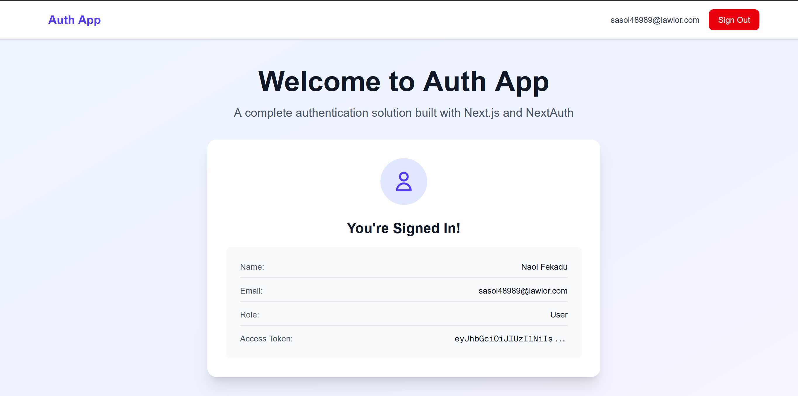
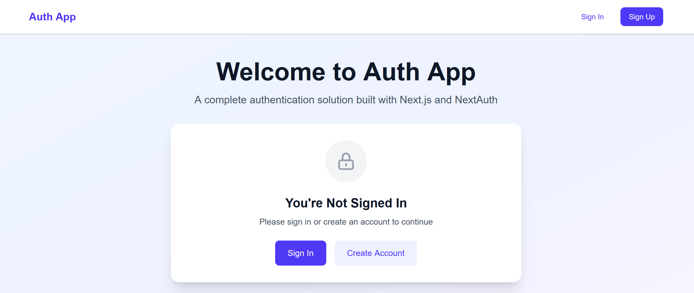
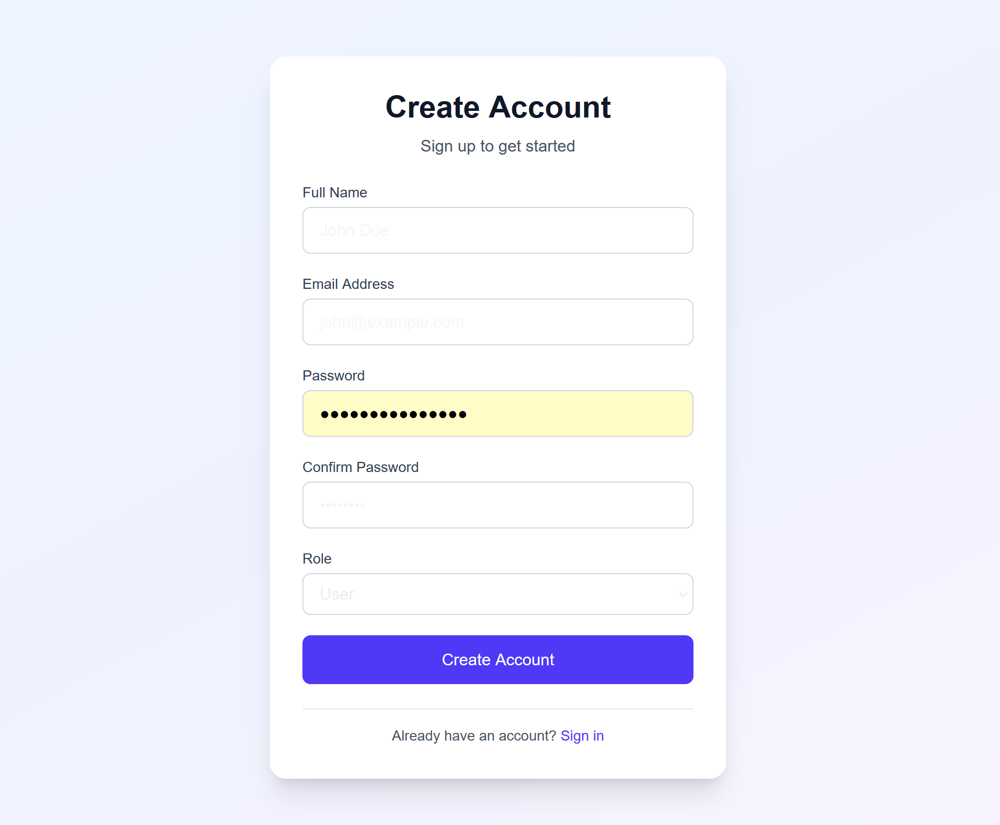
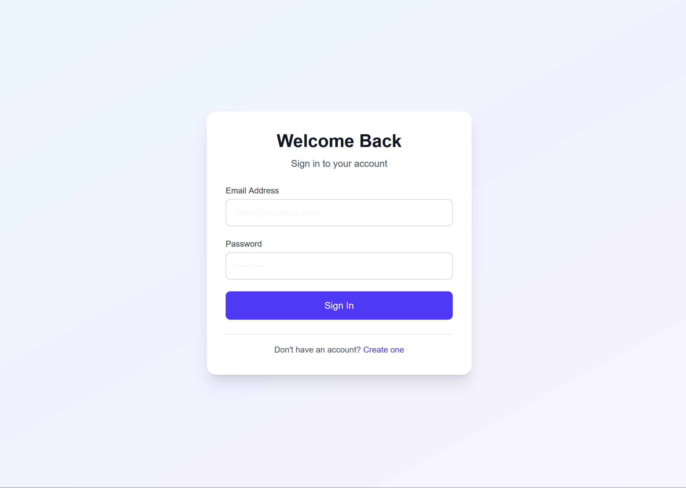

# Task 8: User Authentication with NextAuth.js

This project implements a complete user authentication flow using **Next.js**, **TypeScript**, and **NextAuth.js**. It features custom Signup and Signin pages, integrates with an external REST API, and handles email OTP verification.

## Features

*   **NextAuth.js Integration**: Uses the Credentials Provider for custom authentication logic.
*   **Custom Signup Page**: Includes form validation and redirects to email verification.
*   **Email Verification**: Dedicated page to enter OTP code sent to the user's email.
*   **Custom Signin Page**: Handles login errors and guides unverified users to verify their email.
*   **Protected Sessions**: Securely manages user sessions and access tokens using HTTP-only cookies.
*   **Modern UI**: Built with Tailwind CSS, featuring responsive design and visual polish (gradients, loading states, interactions).

## Tech Stack

*   **Framework**: Next.js 15 (App Router)
*   **Language**: TypeScript
*   **Auth**: NextAuth.js v4
*   **Styling**: Tailwind CSS
*   **HTTP Client**: Axios

## Getting Started

1.  **Clone the repository:**
    ```bash
    git clone <repository-url>
    cd auth-project
    ```

2.  **Install dependencies:**
    ```bash
    pnpm install
    ```

3.  **Set up Environment Variables:**
    Create a `.env.local` file in the root directory and add the following:
    ```env
    NEXTAUTH_SECRET="your_secure_random_string"
    NEXTAUTH_URL="http://localhost:3000"
    NEXT_PUBLIC_EXTERNAL_API_BASE_URL="https://akil-backend.onrender.com"
    ```

4.  **Run the development server:**
    ```bash
    pnpm run dev
    ```

5.  **Open the app:**
    Visit [http://localhost:3000](http://localhost:3000) in your browser.

## Screenshots

Below are screenshots demonstrating the authentication flow:

### 1. Home Page & Signup


### 2. Sign In


### 3. Verify Email (OTP)


### 4. Authenticated Session

