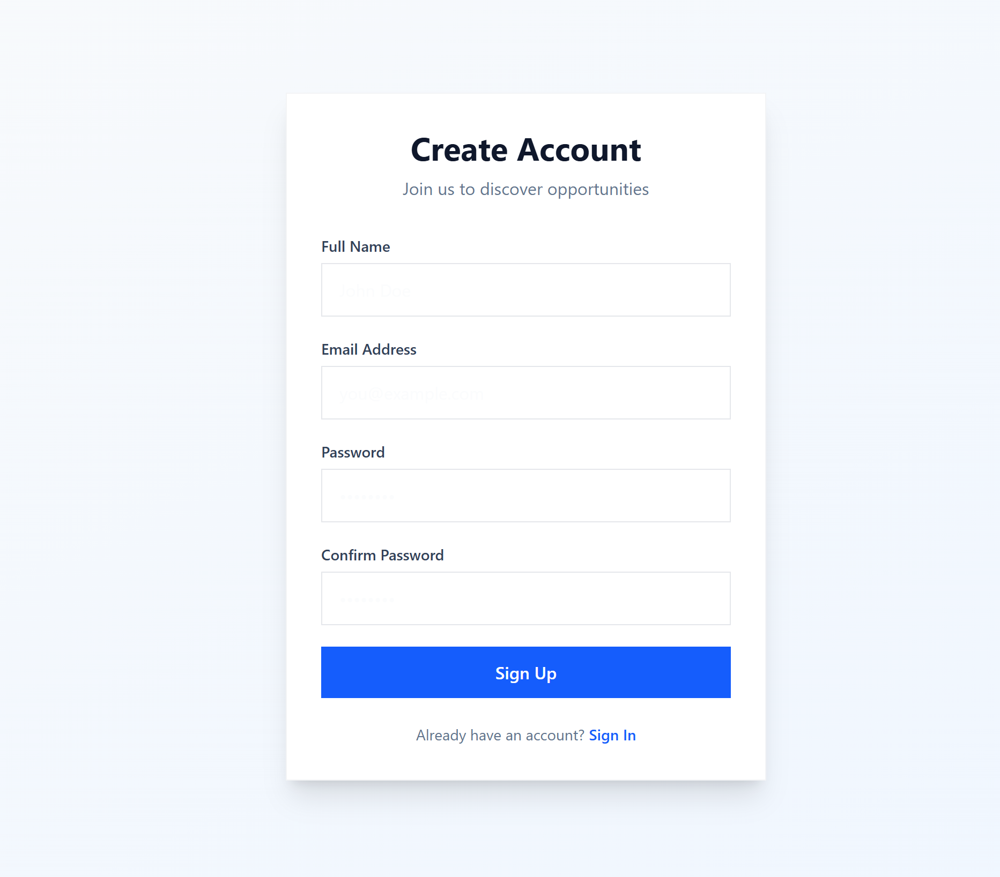
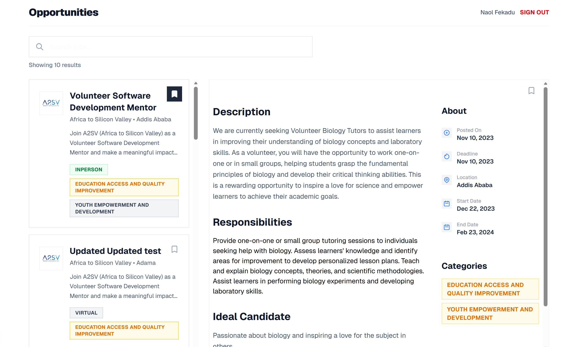
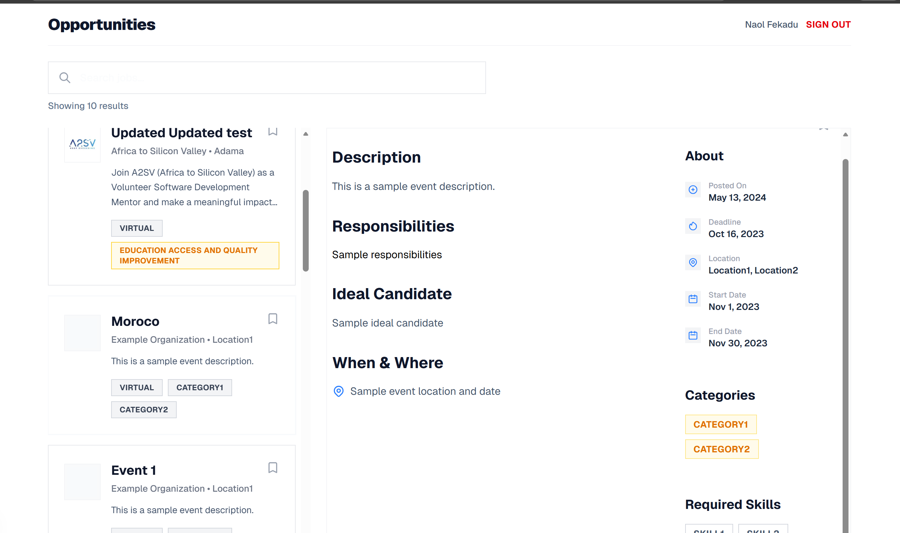

# Job Listing Application

A modern job board built with the **Next.js App Router**, featuring a "Sharp & Bold" design aesthetic. It offers a responsive interface for browsing curated opportunities with a synchronized detail view.

## Tech Stack
-   **Core**: Next.js 16, React 19
-   **Styling**: Tailwind CSS v4 (PostCSS)
-   **Language**: TypeScript
-   **Assets**: Next/Image for optimized media

## Key Features
-   **Master-Detail Layout**: Split view on desktop for efficient browsing; standard navigation on mobile.
-   **Dynamic Routing**: Job details pages generated from unique IDs.
-   **Sharp Design**: High-contrast, boxy UI with distinct typography.
-   **Type-Safe Data**: Fully typed job listings and API responses.

## Screenshots

### Main Opportunities List


### Split View / Desktop Layout


### Sign In / Sign Up


## Getting Started

1.  **Install dependencies**:
    ```bash
    npm install
    # or
    pnpm install
    ```

2.  **Run development server**:
    ```bash
    npm run dev
    ```
    Open [http://localhost:3000](http://localhost:3000) to view the app.

3.  **Build for production**:
    ```bash
    npm run build
    npm start
    ```

## Project Structure
-   `src/app/`: App Router pages and layouts (including the main `page.tsx`).
-   `src/components/`: Reusable UI components (`JobCard`, `JobDetail`, etc.).
-   `src/lib/`: Data fetching and utilities.
-   `src/types/`: TypeScript definitions.
-   `src/public/images/`: Static assets.
