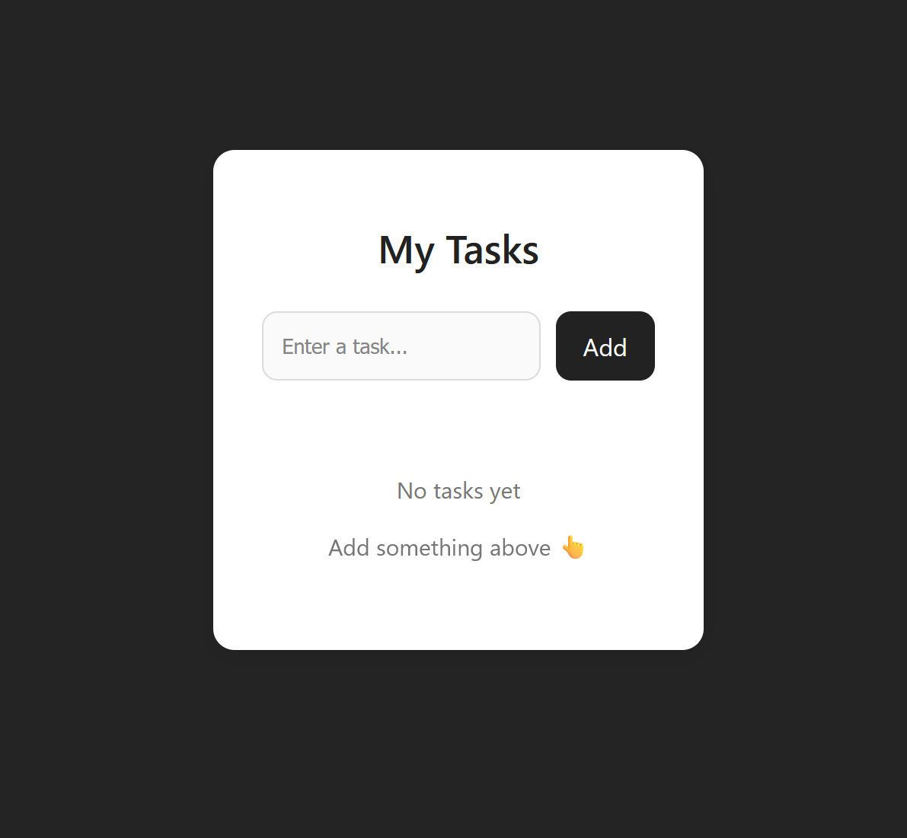
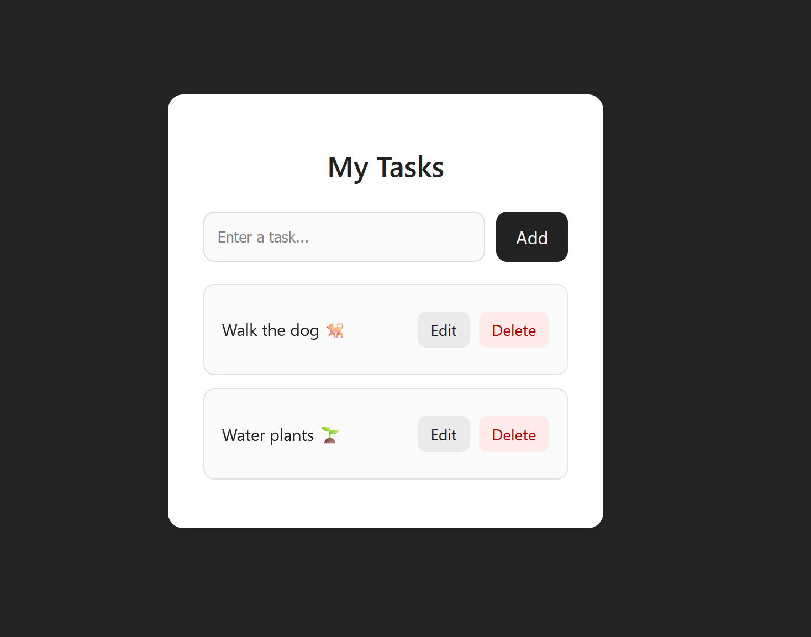
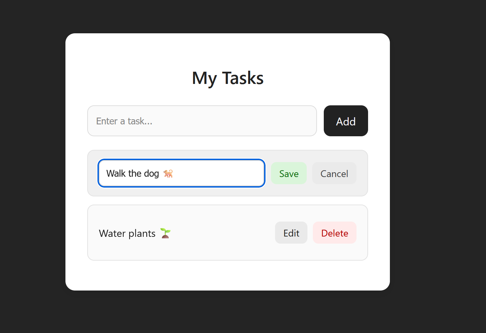
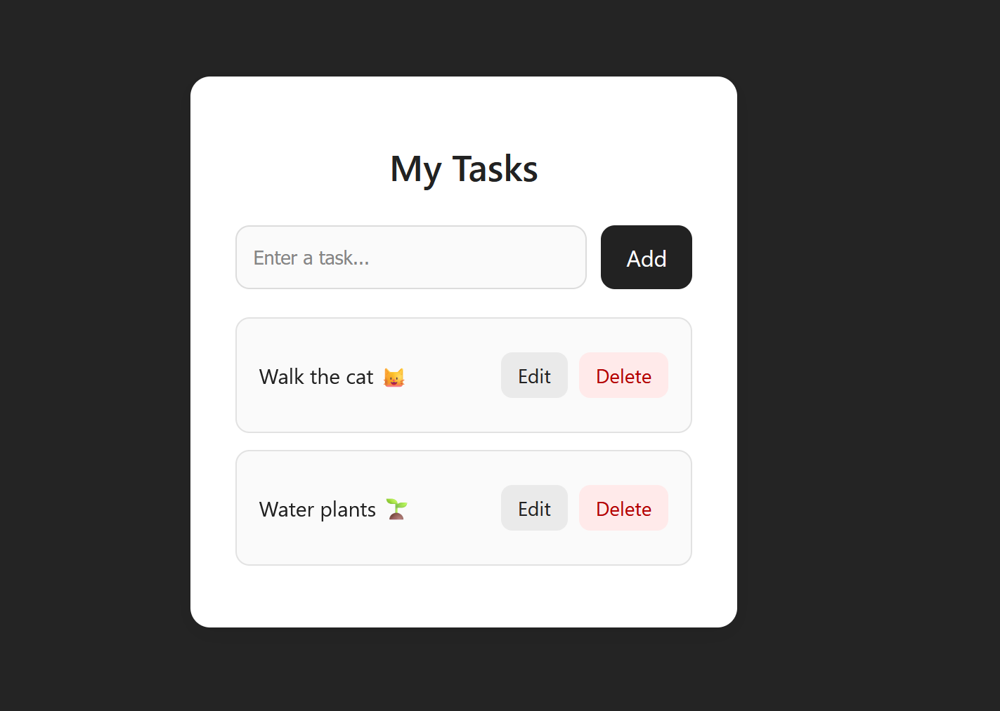
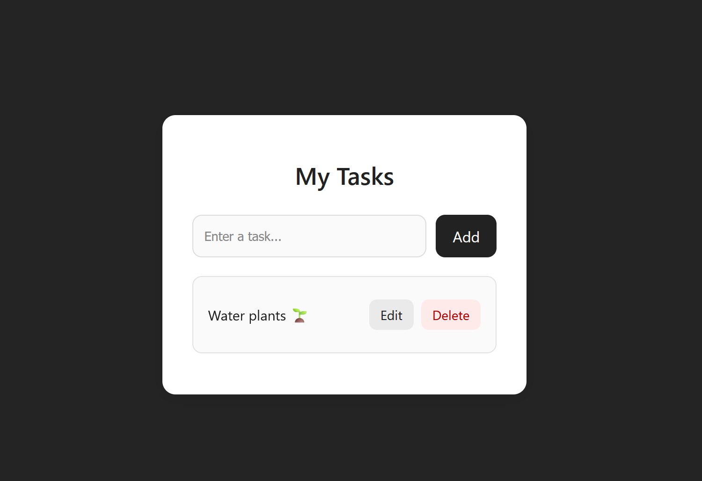

# React + TypeScript Todo List App

A simple Todo List application built with **React** and **TypeScript**.  
Users can **add**, **edit**, and **delete** tasks.  
The project also includes basic styling using CSS.

---

## 🚀 Features

- Add new tasks  
- Edit existing tasks  
- Delete tasks  
- Organized using React components  
- Built with TypeScript for type safety  
- Styled using plain CSS  

---

## 📦 Technologies Used

- React
- TypeScript
- Vite (for fast development)
- CSS

---

## 📁 Folder Structure

```
src/
│  App.tsx
│  App.css
│  main.tsx
│
└─ components/
   ├─ TodoForm.tsx
   └─ TodoItem.tsx
```

---

## ▶️ How to Run the Project

1. Clone the repository:

```
git clone https://github.com/nalonix/A2SV-Submissions/tree/main/react-todo-app
```

2. Navigate to the project folder:

```
cd react-todo-app
```

3. Install dependencies:

```
npm install
```

4. Start the development server:

```
npm run dev
```

5. Open the app in your browser:

```
http://localhost:5173/
```

---

## 📄 Screenshots








---

## 📜 License

This project is open-source and free to use.

